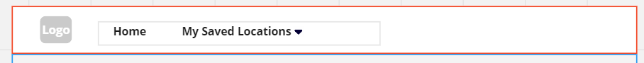
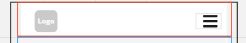
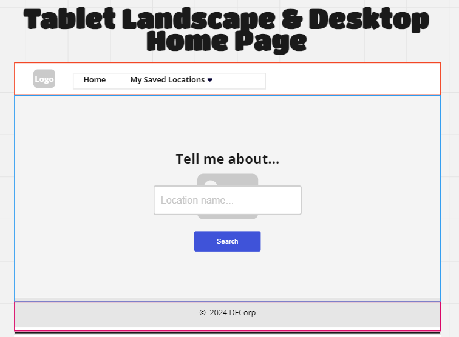
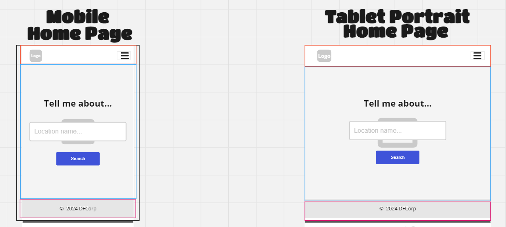
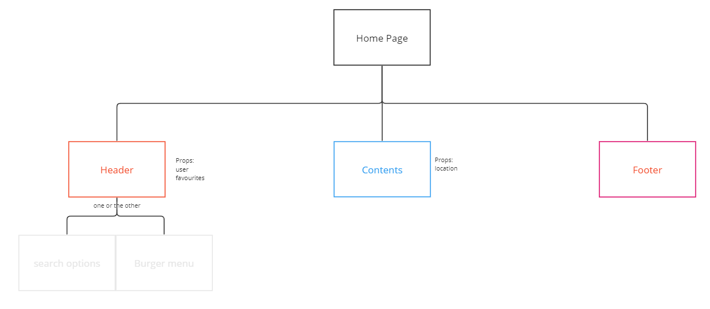

# Component hierchy and reasoning

## Site Overview

Based upon the wire frames, there are 5 distinct pages that need to be created. They all need access to the user login information and the Users favourited locations to allow this information to be referenced in the header. some of the pages also require access to the weather data for a location, the map data and hotel data. To facilitate passing this data into these components it is necessary to have a parent component to maintain this data in state, and pass it to the components as props.

There are also two components which exist on all screens, the header and the footer.

### The Footer

This is the simplest of the components, and consists of a simple text line centralised in the middle of the screen. This will be one component attached to the bottom of the screen set to fill the width of the screen in a solid, thematically correct colour.

### The Header

More complex than the footer, this one needs to have the logo on the left hand side, but also needs to be responsive to the screen it is being displayed upon. On a desktop or tablet displaying in landscape, it needs to have options to return to the home page and a drop down menu of the users favourited locations.

On the mobile or tablet in portrait, these need to be hidden a menu which can be accessed by the user

this will require the user's favourites to be passed in as a prop. If the user has not yet selected any locations to save, the drop down menu should not be visible.

There should also be a log in/log out component on the right hand side, which collapses into the menu on the smaller screen.

## Home page

### The Wire Frames

### The Component Hierchy

### Reasoning

The home page is relatively simple. It consists of the header, the footer, a search box and a button to submit the search which can fit on a single component for the page which calls the header and footer. No additional components are needed. The triggering user action will be a button press or the user hitting the enter key while typing in the location name box. The only data that needs to be passed in therefore is the data for the header and if an error message needs to be passed onto the user. Entering a location will trigger a request to the server for information about the location entered. This in turn will trigger a state change to the location data which will either trigger the home page to update with a location not found message to the user if the place name is invalid or trigger the site to load the telling you about page for that location.

