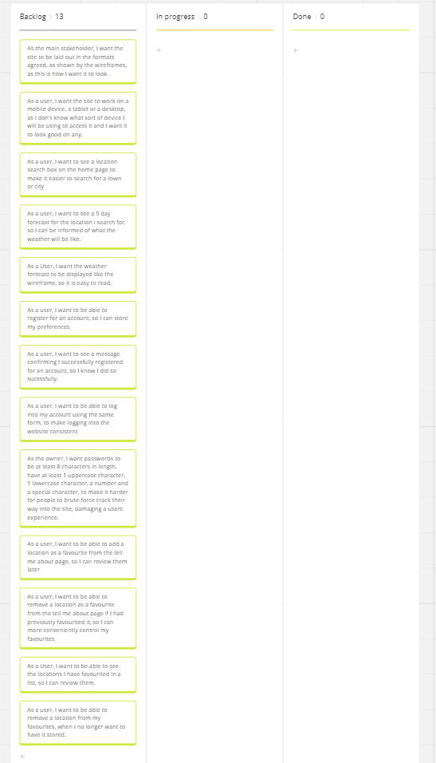

# User Stories

## User Story 1

As the main stakeholder, I want the site to be laid out in the formats agreed, as shown by the wireframes, as this is how I want it to look.

## User Story 2

As a user, I want the site to work on a mobile device, a tablet or a desktop, as I don't know what sort of device I will be using to access it and I want it to look good on any.

## User Story 3

As a user, I want to see a location search box on the home page to make it easier to search for a town or city

## User Story 4

As a user, I want to see a 5 day forecast for the location i search for, so I can be informed of what the weather will be like.

## User Story 5

As a User, I want the weather forecast to be displayed like the wireframe, so it is easy to read.

## User Story 6

As a user, I want to be able to register for an account, so I can store my preferences

## User Story 7

As a user, I want to see a message confirming I successfully registered for an account, so I know I did so successfully.

## User Story 8

As a user, I want to be able to log into my account using the same form, to make logging into the website consistent

## User Story 9

As the owner, I want passwords to be at least 8 characters in length, have at least 1 uppercase character, 1 lowercase character, a number and a special character, to make it harder for people to brute-force crack their way into the site, damaging a users experience.

## User Story 10

As a user, I want to be able to add a location as a favourite from the tell me about page, so I can review them later

## User Story 11

As a user, I want to be able to remove a location as a favourite from the tell me about page if I had previously favourited it, so I can more conveniently control my favourites

## User Story 12

As a User, I want to be able to see the locations I have favourited in a list, so I can review them.

## User Story 13

As a user, I want to be able to remove a location from my favourites, when I no longer want to have it stored.

## User Story 14

As a user, I only want to see the dropdown list of favourites, if I have favourites to have in it, so it doesn't have an empty box just sitting there
